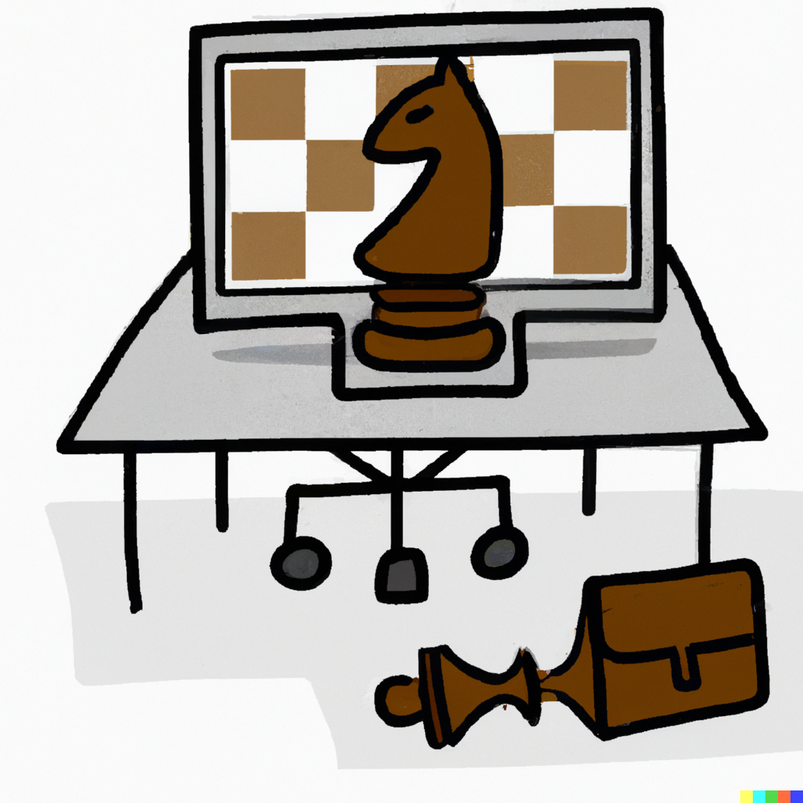
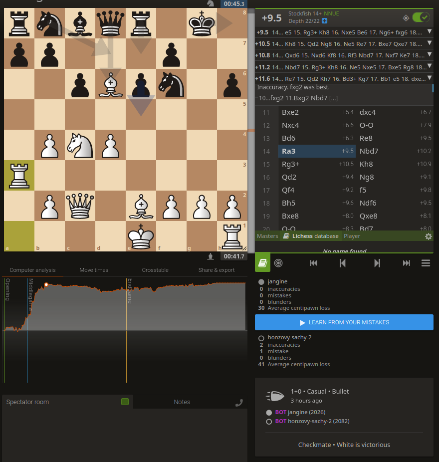
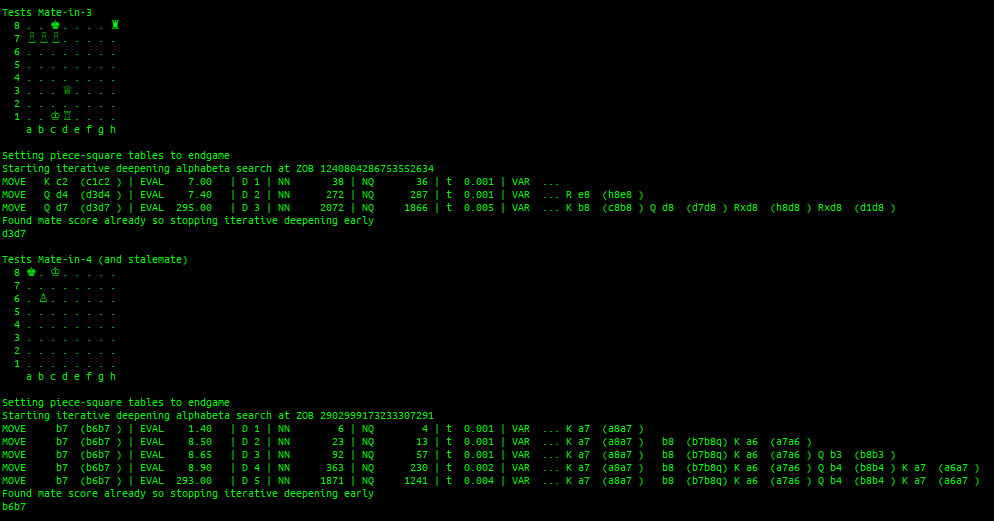

# Jangine -- Jan's C++ chess engine

**Jangine** is a chess engine (computer program that plays chess) I wrote in 2022 (parts in 2015).



_Logo of Jangine, created by DALL-E_

- **Board representation** is done with [10x12 boards](https://www.chessprogramming.org/10x12_Board).
  - This is similar to 8x8 boards but only needs a single
      index to address each square, instead relying on sentinel values for efficient out-of-bounds detection.
      This leads to a simple programming model.
  - Speed could be improved with the more advanced technique of bitboards which I haven't had time to research yet.

- **Evaluation** is very simple. It is based entirely on material counting and
  [piece-square tables](https://www.chessprogramming.org/Piece-Square_Tables).
  - This means each piece type gets a value based on the square it is on and the game phase (middlegame/endgame).
  - The square values were obtained from looking at other engines, my chess player intuition, and testing.
  - The piece values were chosen to stop the engine from giving up N+B for R+P or Q for R+R.

- **Search**: Traditional [alpha-beta search](https://www.chessprogramming.org/Alpha-Beta) with
  [quiescence search](https://www.chessprogramming.org/Quiescence_Search) for correctness.
  - Transposition table of constant size 176 MiB for storing information about searched positions.
  - Iterative deepening is used so that the best move from depth-n-search can be stored as hash move in the hash table
    and tried first during depth-(n+1)-search.
  - Depth extensions for
      1. checks
      2. pawn reaching seventh rank
  - In order to generate as many alpha-beta cutoffs as possible, moves are tried in the following order:
      1. Hash move
      2. Captures in MVV-LVA order
      3. Killer moves (killer heuristic)
      4. Other quiet moves (incl. promotions) in no particular order

- For now: No principal variation search (did not speed program up), no null move pruning,
    no late move reductions (risky!), no futility pruning (I cannot detect checks efficiently),
    no delta pruning, no static exchange evaluation.

- **Opening/endgame optimizations**:
  - No opening or endgame database is built-in, and should be provided externally.
  - No specialized strategies either, so even simple endgame plans might not be found.

- **Time management**:
  - Iterative deepening, keep deepening while trying to use under 5% of the remaining time.

- **Language choice**:
  - C (later C++) was chosen in 2015 due to superior speed over most languages.
  - Because I had no C/C++ experience in 2015 (and still don't have very much), there are code quality issues.
  - Since many features (e.g. using a std::map vs a static C array) of C++ are too slow for
      my use case I am thinking of switching the engine back to C entirely.

- **UCI/XBoard support**: Partial, both being worked on.

- **GUI**: I use the Arena Chess GUI for testing.

- **Strength**: On a (Ryzen 3600X single-core):
    - [33d1b644 2022-06-20] Was able to beat my NM friend 6-0 in Blitz (3+0) and 37½-2½ (35W 3D 1L) in Bullet (1+0)
    - Not officially assessed by [CCRL](http://ccrl.chessdom.com/ccrl/404/), but here are estimates based on online
        matches played on Lichess:
    ```
    - [8a78bead 2022-07-11] 41 - 59  (41  %) vs Honzovy Šachy 2.0 (2060) (implied CCRL 1995)
    - [a6ef6d49 2022-07-06] 70 -130  (35  %) vs Honzovy Šachy 2.0 (2060) (implied CCRL 1950)
    - [8f7c031a 2022-07-03] 25½- 74½ (25.5%) vs Fornax (2296)            (implied CCRL 2010)
    - [8f7c031a 2022-07-03] 91 -  9  (91  %) vs zeekat (?)               (implied zeekat+400)
    ```

**Play me on Lichess!** https://lichess.org/@/jangine

 


## Usage

Build:

    g++ -Ofast jangine.cpp -o jangine

Build on Linux for Windows:

    sudo apt install mingw-w64
    x86_64-w64-mingw32-g++ -Wall -c -g -Ofast jangine.cpp -o jangine.o
    x86_64-w64-mingw32-g++ -static -static-libgcc -static-libstdc++ -o jangine.exe jangine.o

Run the included test suites:

    # Validate move generation using move path enumeration ("perft")
    ./jangine -p
    # Run set of demo positions (checkmate, stalemate, promotion, en passant, etc.)
    ./jangine -t
    # Solve tactics exercises from the book "Win At Chess"
    python test_win_at_chess.py  # Python >= 3.7

Run as an interactive (stdin/stdout) UCI engine:

    ./jangine

To host bot for lichess, clone the lichess-bot project https://github.com/ShailChoksi/lichess-bot and place the
engine binary in the `engines/` folder.


## Versions

| Version    | vs previous | est. CCRL | <improve | CCRL |
|------------|-------------|-----------|----------|------|
| 2022-12-01 | -           | 1900      | -        | -    |
| 2022-12-27 | 342.0/500   | 2033      | +133     | -    |

CCRL rating estimated by self-play against other versions of Jangine:

    1 / (1 + 10^((ratingA - ratingB)/400))  =  scorePercentage
