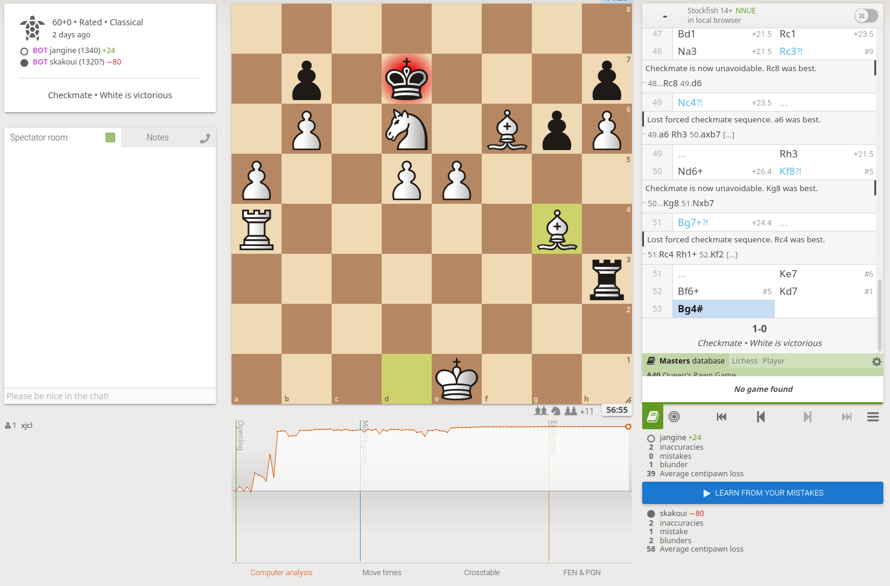

# jangine -- Jan's Basic C++ chess engine

Chess engine I wrote in 2015 that can beat a competent beginner.
- Strength should be around **1200 Lichess**. It's good at taking free material and giving checkmate, but bad at avoiding pins and endgames.
- This was my first C++ project which is why the code is poorly written and **leaks memory**. That's why a script to periodically restart the engine is included.
- No adjustment to time controls. 30+ minute matches recommended.

Challenge me on lichess! https://lichess.org/@/jangine

## Usage

Build

    g++ jangine.cpp -o jangine

Run

    ./jangine

To run with lichess, clone this project https://github.com/ShailChoksi/lichess-bot and place the engine binary in the "engine" folder.
